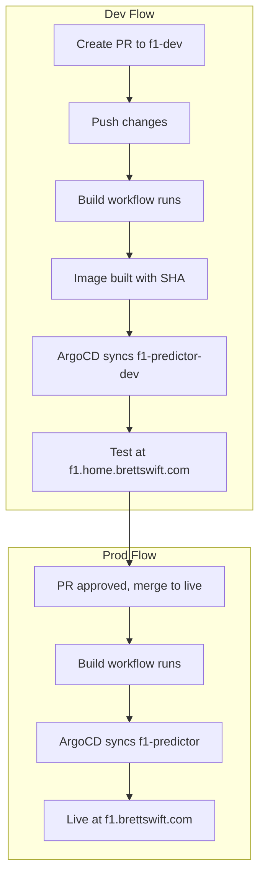

# F1 Predictor Workflow

End-to-end workflow for developing, testing, and promoting f1-predictor changes.

## Overview



| Environment | Branch | URL | ArgoCD App |
|-------------|--------|-----|------------|
| Dev | f1-dev | https://f1.home.brettswift.com | f1-predictor-dev |
| Prod | live | https://f1.brettswift.com | f1-predictor |

## Workflow Steps

### 1. Create or update a PR targeting f1-dev

All f1-predictor changes go through the f1-dev branch first:

```bash
# Create feature branch from f1-dev
git checkout f1-dev
git pull origin f1-dev
git checkout -b feat/my-change

# Make changes, commit, push
git add .
git commit -m "feat(f1): description"
git push -u origin feat/my-change
```

Open a PR: `feat/my-change` → `f1-dev`.

### 2. Build triggers automatically

When you push to f1-dev (or when the PR is merged):

- **Workflow:** `build-f1-predictor-dev.yml`
- **Trigger:** Any push to f1-dev except changes to `overlays/dev/kustomization.yaml`
- **Actions:**
  1. Extracts short SHA from the commit
  2. Updates `overlays/dev/kustomization.yaml` with `newTag: <sha>`
  3. Pushes the manifest update
  4. Builds the Docker image
  5. Pushes `ghcr.io/brettswift/f1-predictor:<sha>` to GHCR

### 3. ArgoCD syncs dev

- ArgoCD app `f1-predictor-dev` tracks `f1-dev` branch
- Path: `apps/f1-predictor/overlays/dev`
- On push, ArgoCD syncs and deploys the new image to namespace `f1-predictor-dev`
- Dev is live at **https://f1.home.brettswift.com**

### 4. Test in dev

- Open https://f1.home.brettswift.com
- Verify your changes (manual testing, OpenClaw, or other automation)
- Dev shows a DEV badge; prod does not

### 5. Merge PR to live

When dev is verified:

1. Merge the PR: `f1-dev` → `live`
2. **Workflow:** `build-f1-predictor-prod.yml` runs
3. **Trigger:** Any change under `apps/f1-predictor/**` except `overlays/prod/kustomization.yaml`
4. Workflow updates `overlays/prod/kustomization.yaml` with the new SHA and builds
5. ArgoCD app `f1-predictor` syncs from `live`
6. Prod deploys at **https://f1.brettswift.com**

### 6. Optional: Manual build

If the build did not trigger (e.g. only docs changed):

- **Dev:** Actions → Build f1-predictor dev image → Run workflow
- **Prod:** Actions → Build f1-predictor prod image → Run workflow

## Branch and overlay mapping

| Branch | Overlay | ArgoCD App | Namespace |
|--------|---------|------------|-----------|
| f1-dev | overlays/dev | f1-predictor-dev | f1-predictor-dev |
| live | overlays/prod | f1-predictor | f1-predictor |

ArgoCD never tracks feature branches. It tracks `f1-dev` and `live` only.

## Image tagging (Git SHA)

Images use the short git hash, not `:latest` or `:dev`:

- Ensures dev and prod run identical code when you promote
- ArgoCD sees the new tag before the image exists → brief ImagePullBackOff → retry succeeds once build completes
- Same SHA in dev and prod after merge

## Path filters (avoid loops)

Workflows push manifest updates. Path filters prevent infinite loops:

| Workflow | paths-ignore |
|----------|--------------|
| build-f1-predictor-dev | `overlays/dev/kustomization.yaml` |
| build-f1-predictor-prod | `overlays/prod/kustomization.yaml` |

When the workflow commits a kustomization change, that commit does not re-trigger the workflow.

## Troubleshooting

### Build did not run

- **Dev:** Push must touch `apps/f1-predictor/` and not be *only* `overlays/dev/kustomization.yaml`
- **Prod:** Push to live must touch `apps/f1-predictor/` and not be *only* `overlays/prod/kustomization.yaml`
- Trigger manually via Actions → Run workflow

### ImagePullBackOff

- Build may still be in progress (image does not exist yet)
- Wait for the workflow to finish; kubelet will retry
- Check: `kubectl get pods -n f1-predictor-dev` or `-n f1-predictor`

### ArgoCD out of sync

- ArgoCD syncs automatically (selfHeal: true)
- Manual sync: ArgoCD UI → f1-predictor or f1-predictor-dev → Sync
- Check: `kubectl get applications -n argocd`

### Dev and prod show different versions

- Dev: from `f1-dev` branch
- Prod: from `live` branch
- After merging f1-dev → live, prod build runs and catches up

## Related docs

- [README.md](./README.md) – Environments, config, DNS, TLS
- [DEPLOYMENT.md](./DEPLOYMENT.md) – Build flow, ArgoCD, GHCR, manual build
- [cron/README.md](./cron/README.md) – Race results auto-fetcher
