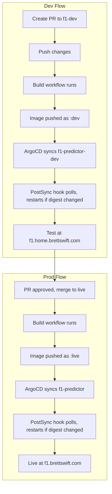

# F1 Predictor Workflow

End-to-end workflow for developing, testing, and promoting f1-predictor changes.

## Overview



| Environment | Branch | URL | ArgoCD App |
|-------------|--------|-----|------------|
| Dev | f1-dev | https://f1.home.brettswift.com | f1-predictor-dev |
| Prod | live | https://f1.brettswift.com | f1-predictor |

## Workflow Steps

### 1. Create or update a PR targeting f1-dev

All f1-predictor changes go through the f1-dev branch first:

```bash
# Create feature branch from f1-dev
git checkout f1-dev
git pull origin f1-dev
git checkout -b feat/my-change

# Make changes, commit, push
git add .
git commit -m "feat(f1): description"
git push -u origin feat/my-change
```

Open a PR: `feat/my-change` → `f1-dev`.

### 2. Build triggers automatically

When you push to f1-dev (or when the PR is merged):

- **Workflow:** `build-f1-predictor-dev.yml`
- **Trigger:** Any push to f1-dev
- **Actions:** Builds the Docker image and pushes `ghcr.io/brettswift/f1-predictor:dev` to GHCR (no git commits)

### 3. ArgoCD syncs dev

- ArgoCD app `f1-predictor-dev` tracks `f1-dev` branch
- Path: `apps/f1-predictor/overlays/dev`
- Overlay uses fixed tag `:dev`; deployment has `imagePullPolicy: Always`
- On sync, a **PostSync hook** runs: it polls the registry digest for `:dev` vs the running pod digest; if they differ, it runs `kubectl rollout restart` and waits for rollout; otherwise it exits after ~20×15s. The hook always exits 0 and is deleted before the next sync.
- Dev is live at **https://f1.home.brettswift.com**

### 4. Test in dev

- Open https://f1.home.brettswift.com
- Verify your changes (manual testing, OpenClaw, or other automation)
- Dev shows a DEV badge; prod does not

### 5. Merge PR to live

When dev is verified:

1. Merge the PR: `f1-dev` → `live`
2. **Workflow:** `build-f1-predictor-prod.yml` runs (trigger: any change under `apps/f1-predictor/**` on `live`)
3. Workflow builds and pushes `ghcr.io/brettswift/f1-predictor:live` (no git commits)
4. ArgoCD app `f1-predictor` syncs from `live`; PostSync hook polls registry for `:live` and restarts deployment if digest changed
5. Prod deploys at **https://f1.brettswift.com**

### 6. Optional: Manual build

If the build did not trigger (e.g. only docs changed):

- **Dev:** Actions → Build f1-predictor dev image → Run workflow
- **Prod:** Actions → Build f1-predictor prod image → Run workflow

## Branch and overlay mapping

| Branch | Overlay | ArgoCD App | Namespace |
|--------|---------|------------|-----------|
| f1-dev | overlays/dev | f1-predictor-dev | f1-predictor-dev |
| live | overlays/prod | f1-predictor | f1-predictor |

ArgoCD never tracks feature branches. It tracks `f1-dev` and `live` only.

## Image tagging (mutable :dev / :live)

Images use fixed mutable tags:

- **Dev:** `ghcr.io/brettswift/f1-predictor:dev`
- **Prod:** `ghcr.io/brettswift/f1-predictor:live`

There are no GHA commits; overlays always reference `:dev` or `:live`. New builds overwrite the same tag. The PostSync hook detects digest changes and triggers a rollout restart so new images are picked up after ArgoCD sync.

## Troubleshooting

### Build did not run

- **Dev:** Any push to f1-dev triggers the dev build
- **Prod:** Push to live with changes under `apps/f1-predictor/**` triggers the prod build
- Trigger manually via Actions → Run workflow

### ImagePullBackOff

- Build may still be in progress (image does not exist yet)
- Wait for the workflow to finish; kubelet will retry
- Check: `kubectl get pods -n f1-predictor-dev` or `-n f1-predictor`

### ArgoCD out of sync

- ArgoCD syncs automatically (selfHeal: true)
- Manual sync: ArgoCD UI → f1-predictor or f1-predictor-dev → Sync
- Check: `kubectl get applications -n argocd`

### PostSync hook / image not updating

- Hook runs after each sync; it polls up to ~20×15s for a digest change, then restarts the deployment if needed
- Hook always exits 0; check job logs: `kubectl logs job/image-refresh -n f1-predictor-dev` (or `-n f1-predictor`)
- For private GHCR, ensure the hook can read the manifest (see DEPLOYMENT.md)

### Dev and prod show different versions

- Dev: `:dev` image from f1-dev builds
- Prod: `:live` image from live builds
- After merging f1-dev → live, prod build runs and pushes new `:live`; next sync + hook will roll out the new image

## Related docs

- [README.md](./README.md) – Environments, config, DNS, TLS
- [DEPLOYMENT.md](./DEPLOYMENT.md) – Build flow, ArgoCD, GHCR, manual build
- [cron/README.md](./cron/README.md) – Race results auto-fetcher
