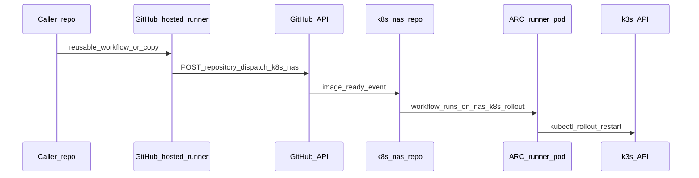

# Event-driven image refresh (repository_dispatch + ARC)

This document describes how **new GHCR images** trigger **in-cluster rollouts** without polling the registry from Kubernetes.

## Flow



1. A **caller** workflow (same org or copy-pasted) runs on `ubuntu-latest` and triggers [`repository_dispatch`](https://docs.github.com/en/rest/repos/repos#create-a-repository-dispatch-event) on `k8s_nas` with `event_type: image_ready` and `client_payload.app` set to an inventory key.
2. [`.github/workflows/image-ready-dispatch.yml`](../.github/workflows/image-ready-dispatch.yml) runs on the **runner scale set** named **`nas-k8s-rollout`** (see `runs-on` in that file).
3. The workflow runs [`scripts/run-image-refresh-inventory.py`](../scripts/run-image-refresh-inventory.py) using [`scripts/image-refresh-inventory.json`](../scripts/image-refresh-inventory.json).

## Reusable workflow vs copy-paste

| Approach | When to use |
| --- | --- |
| **`uses: brettswift/k8s_nas/.github/workflows/dispatch-image-ready-reusable.yml@live`** | Same GitHub org, caller repo is allowed to use reusable workflows from `k8s_nas` (Settings → Actions → General). |
| **Copy** [dispatch-image-ready-reusable.yml](../.github/workflows/dispatch-image-ready-reusable.yml) into the caller repo | Different org, enterprise policy blocks reusable workflows, or you prefer zero cross-repo coupling. |

**Branch:** Callers should reference **`@live`** if that is your default branch for `k8s_nas` (matches Argo CD `targetRevision`).

### Caller repo setup

1. Add an Actions secret **`K8S_NAS_DISPATCH_PAT`** (fine-grained or classic PAT) that can call `repository_dispatch` on **`brettswift/k8s_nas`** (for private repos, the token must have access to that repository; see GitHub’s current PAT documentation).
2. In the caller repo: **Settings → Actions → General → Access** — allow workflows to use reusable workflows from **`brettswift/k8s_nas`** (when using `uses:`).

### Example caller job

```yaml
notify-cluster-image-ready:
  needs: build
  if: success()
  uses: brettswift/k8s_nas/.github/workflows/dispatch-image-ready-reusable.yml@live
  secrets:
    K8S_NAS_DISPATCH_PAT: ${{ secrets.K8S_NAS_DISPATCH_PAT }}
  with:
    app: f1-predictor
    sha: ${{ github.sha }}
```

## ARC (runner scale set) on the cluster

GitOps manifests live under:

- [`apps/infrastructure/github-actions-runner/`](../apps/infrastructure/github-actions-runner/) — namespace `arc-runners`, `ServiceAccount` **`arc-nas-runner`**, **`ClusterRoleBinding`** to **`cluster-admin`** (full cluster access for rollouts and future Job-based automation in any namespace).
- [`argocd/applicationsets/arc-runner-scale-set-controller.yaml`](../argocd/applicationsets/arc-runner-scale-set-controller.yaml) — installs **`gha-runner-scale-set-controller`** into **`arc-system`** (chart `0.10.1` from `ghcr.io/actions/actions-runner-controller-charts`).
- [`argocd/applicationsets/arc-runner-scale-set-nas.yaml`](../argocd/applicationsets/arc-runner-scale-set-nas.yaml) — installs **`gha-runner-scale-set`** as Helm release **`nas-k8s-rollout`** into **`arc-runners`**, with values from [`helm/values-scale-set-nas.yaml`](../apps/infrastructure/github-actions-runner/helm/values-scale-set-nas.yaml).

**`runs-on`:** For [runner scale sets](https://docs.github.com/en/actions/how-tos/manage-runners/use-actions-runner-controller/deploy-runner-scale-sets), workflows must use the **scale set name** as `runs-on` (here: **`nas-k8s-rollout`**), not only `self-hosted` labels.

### GitHub App or PAT for runner registration

Before the scale set can register runners, create a Kubernetes **`Secret`** in namespace **`arc-runners`** named **`arc-github-app-credentials`** (name matches `githubConfigSecret` in values):

**GitHub App (recommended)**

```bash
kubectl create secret generic arc-github-app-credentials -n arc-runners \
  --from-literal=github_app_id='YOUR_APP_ID' \
  --from-literal=github_app_installation_id='YOUR_INSTALLATION_ID' \
  --from-literal=github_app_private_key="$(cat ./your-app-private-key.pem)"
```

**Classic PAT**

```bash
kubectl create secret generic arc-github-app-credentials -n arc-runners \
  --from-literal=github_token='ghp_...'
```

The App or PAT must be allowed to register **repository** runners for **`brettswift/k8s_nas`** (matches `githubConfigUrl` in values).

### Argo CD

- The **`infrastructure`** AppProject allows **`arc-system`**, **`arc-runners`**, and the OCI chart repo (see [`argocd/projects/infrastructure.yaml`](../argocd/projects/infrastructure.yaml)).
- The scale set Application uses **multi-source** (`$values` ref). Argo CD **2.6+** is required. If your Argo CD is older, upgrade or inline the Helm values in the Application manifest.

If Argo CD cannot pull OCI charts anonymously, add the Helm OCI repository in Argo CD settings (same URL as `repoURL`).

### Manual test

1. In `k8s_nas`: **Actions → Image ready — rollout from inventory → Run workflow**, set `app` to a key present in `image-refresh-inventory.json`.
2. Confirm a runner pod appears in **`arc-runners`** and the job completes.

## Inventory format

See [`scripts/image-refresh-inventory.json`](../scripts/image-refresh-inventory.json). Each key under the root object names an **`app`** sent in `client_payload`. Each entry has a **`targets`** array of `{ "namespace", "deployment" }` objects.

## Troubleshooting

| Symptom | Likely cause |
| --- | --- |
| Dispatch workflow fails with `401` / `403` | PAT missing, wrong scopes, or reusable workflow access not allowed from the caller repo. |
| **`image-ready-dispatch`** queued forever | No runner registered for scale set **`nas-k8s-rollout`**; check controller logs, GitHub App install, and secret **`arc-github-app-credentials`**. |
| Rollout fails with RBAC errors | Runner `ServiceAccount` should be **`arc-nas-runner`** (cluster-admin binding). Confirm pod spec uses that SA. |
| Argo CD sync denied | AppProject `infrastructure` missing a resource kind or namespace; compare with the ARC manifests and extend the project if you upgrade chart versions. |

## References

- [Deploying runner scale sets](https://docs.github.com/en/actions/how-tos/manage-runners/use-actions-runner-controller/deploy-runner-scale-sets)
- [Actions Runner Controller charts](https://github.com/actions/actions-runner-controller/tree/master/charts)
