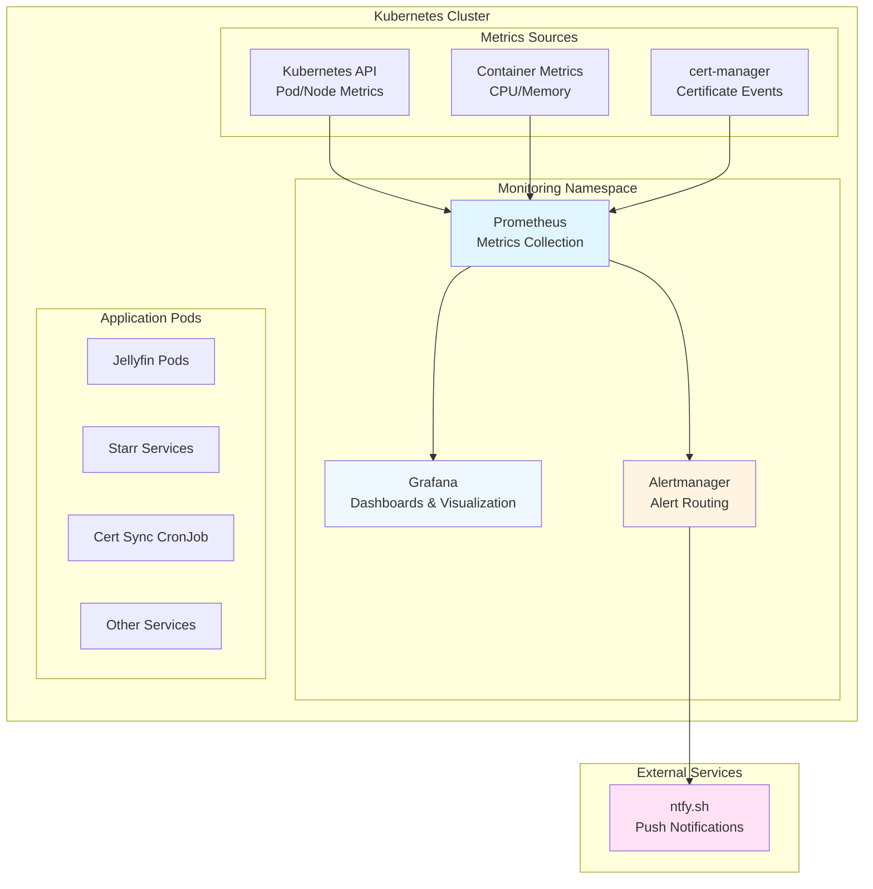
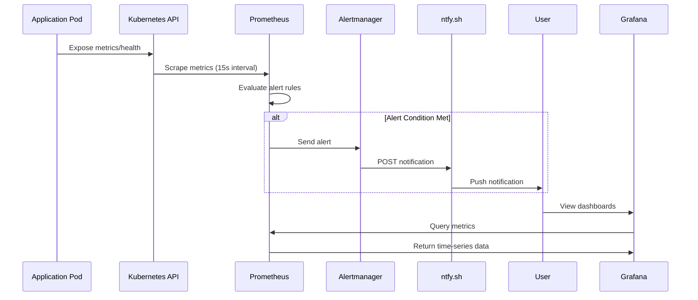
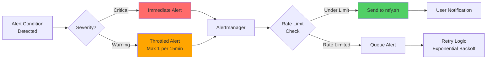

# Monitoring & Alerting Design - k8s_nas

**Document Type:** High-Level Architecture Design  
**Date:** 2025-01-27  
**Status:** Design Proposal

---

## Executive Summary

This document outlines a lightweight, flexible monitoring and alerting solution for the k8s_nas Kubernetes cluster using Prometheus + Grafana with ntfy.sh for alerting. The design focuses on pod resource utilization, certificate refresh tracking, pod health monitoring, and basic cluster metrics for troubleshooting.

---

## Architecture Overview

### Component Diagram



### Data Flow



---

## Monitoring Scope

### 1. Pod Resource Utilization

**Metrics Collected:**
- CPU usage (requests, limits, actual usage)
- Memory usage (requests, limits, actual usage)
- Pod restart count
- Pod phase (Running, Pending, Failed, etc.)

**Collection Method:**
- cAdvisor metrics via Kubernetes API
- Prometheus uses `kubernetes-pods` service discovery
- Default scrape interval: 15 seconds

**Key Queries:**

```promql
container_cpu_usage_seconds_total
container_memory_working_set_bytes
kube_pod_status_phase
kube_pod_container_status_restarts_total
```

### 2. Certificate Refresh Tracking

**Metrics Collected:**
- Certificate expiry dates
- Certificate renewal events
- cert-sync CronJob execution status
- Certificate sync success/failure

**Collection Method:**
- cert-manager metrics (if available)
- CronJob status via Kubernetes API
- Certificate resource status

**Alert Triggers:**
- Cert renewal initiated
- Cert renewal completed
- Cert renewal failed
- Certificate expiring soon (< 30 days)

### 3. Pod Health Monitoring

**Metrics Collected:**
- Pod status (Running, CrashLoopBackOff, ImagePullBackOff)
- Container restart count
- Readiness/Liveness probe failures
- Jellyfin-specific health endpoints

**Priority Monitoring:**
- **Jellyfin pods** (highest priority for alerts)
- All media-service namespace pods
- Infrastructure pods (cert-manager, ArgoCD)

**Alert Triggers:**
- Pod not ready for > 5 minutes
- Pod restart count > 3 in 10 minutes
- CrashLoopBackOff state detected
- ImagePullBackOff state detected

### 4. Cluster-Level Utilization

**Metrics Collected:**
- Node CPU/Memory utilization
- Cluster-wide pod count by namespace
- Resource requests vs limits ratio
- Storage usage

**Purpose:**
- Capacity planning
- Resource reconfiguration decisions
- Identify resource contention

---

## Alerting Design

### Alert Workflow



### Alert Categories

#### Critical Alerts (Immediate, No Throttling)

- Jellyfin pod down
- Certificate renewal failed
- Multiple pods failing simultaneously

#### Warning Alerts (Throttled: 1 per 15 minutes per alert type)

- High CPU usage (> 80% for 10 minutes)
- High Memory usage (> 90% for 10 minutes)
- Certificate expiring soon (30 days)
- Single pod restart loop

#### Info Alerts (Throttled: 1 per hour)

- Certificate renewal started
- Certificate renewal completed
- Cert-sync job completed

### Alert Rules Structure

```yaml
# Example Alert Rule Format
groups:
  - name: pod_health
    interval: 30s
    rules:
      - alert: JellyfinPodDown
        expr: kube_pod_status_phase{namespace="media-services", pod=~"jellyfin.*"} == 0
        for: 5m
        labels:
          severity: critical
        annotations:
          summary: "Jellyfin pod is down"
          
  - name: certificates
    interval: 1m
    rules:
      - alert: CertRenewalStarted
        expr: cert_manager_certificate_renewal_started == 1
        labels:
          severity: info
        annotations:
          summary: "Certificate renewal initiated"
```

---

## Dashboard Design

### Main Dashboard: Cluster Overview

**Layout:**

```
┌─────────────────────┬─────────────────────┐
│  Cluster CPU Usage  │ Cluster Memory Usage│
├─────────────────────┼─────────────────────┤
│   Top CPU Pods      │  Top Memory Pods    │
├─────────────────────┴─────────────────────┤
│         Pod Health Status Table          │
└──────────────────────────────────────────┘
```

**Panels:**
1. **Cluster Resource Overview**
   - CPU: Total usage vs capacity (gauge)
   - Memory: Total usage vs capacity (gauge)
   - Active pods by namespace (stat)

2. **Top Resource Consumers**
   - Top 10 pods by CPU (bar chart)
   - Top 10 pods by Memory (bar chart)
   - Sortable by namespace

3. **Pod Health Table**
   - Columns: Namespace, Pod Name, Status, Restarts, CPU %, Memory %
   - Color coding: Red (Failed), Yellow (Pending), Green (Running)
   - Filterable by namespace

### Dashboard: Certificate Management

**Layout:**

```
┌──────────────────────────────────────────┐
│    Certificate Expiry Timeline          │
├──────────────────────────────────────────┤
│  Recent Renewal Events (Last 7 Days)    │
├──────────────────┬──────────────────────┤
│ Renewal Success  │  Renewal Failures    │
│ Rate (24h)       │  Rate (24h)          │
└──────────────────┴──────────────────────┘
```

**Panels:**
1. **Certificate Expiry Timeline**
   - Shows all certificates and days until expiry
   - Warning threshold: 30 days (yellow)
   - Critical threshold: 14 days (red)

2. **Renewal Events**
   - Timeline of renewal start/completion events
   - Success vs failure indicators

3. **Cert-Sync Job Status**
   - Last execution time
   - Success/failure status
   - Execution duration

### Dashboard: Service Health (Per-Namespace)

**Layout:**

```
┌──────────────────────────────────────────┐
│    [Namespace Selector Dropdown]         │
├──────────────────────────────────────────┤
│  Service Health Overview                │
├──────────────────┬──────────────────────┤
│ CPU Usage Trend  │ Memory Usage Trend   │
├──────────────────┴──────────────────────┤
│         Pod Status by Service            │
└──────────────────────────────────────────┘
```

**Features:**
- Namespace selector (media-services, homepage, etc.)
- Service grouping (all Jellyfin pods, all Starr pods)
- Trend lines for resource usage over time
- Pod status aggregation per service

---

## ntfy.sh Integration Strategy

### Rate Limiting Mitigation

**Challenges:**
- Rate limits on ntfy.sh free tier
- Need to prioritize critical alerts

**Solutions:**
1. **Alert Aggregation**
   - Group similar alerts (e.g., multiple pod restarts)
   - Single notification for multiple events in short window

2. **Throttling per Alert Type**
   - Critical: No throttling (immediate)
   - Warning: Max 1 per 15 minutes
   - Info: Max 1 per hour

3. **Alert Routing**
   - Critical alerts → Dedicated ntfy.sh topic: `k8s-critical`
   - Warning alerts → Dedicated ntfy.sh topic: `k8s-warnings`
   - Info alerts → Dedicated ntfy.sh topic: `k8s-info` (optional, can disable)

4. **Fallback Strategy**
   - If rate limited, queue alerts in Alertmanager
   - Retry with exponential backoff
   - Log rate limit events for manual review

### Alert Format

**Notification Structure:**

```
Title: [Severity] Alert Name
Body:
Namespace: <namespace>
Pod: <pod-name>
Status: <current-status>
Duration: <how-long>
Details: <additional-context>
```

**Example:**

```
Title: [CRITICAL] Jellyfin Pod Down
Body:
Namespace: media-services
Pod: jellyfin-6d8f9c4b7-2xklm
Status: CrashLoopBackOff
Duration: 5 minutes
Restarts: 4
Details: Last error - ImagePullBackOff
```

---

## Resource Overhead Analysis

### Component Resource Requirements

**Baseline Resource Allocation:**

| Component | CPU Requests | CPU Limits | Memory Requests | Memory Limits |
|-----------|--------------|------------|-----------------|---------------|
| Prometheus | 200m (0.2 cores) | 500m (0.5 cores) | 400Mi | 1Gi |
| Grafana | 100m (0.1 cores) | 200m (0.2 cores) | 256Mi | 512Mi |
| Alertmanager | 50m (0.05 cores) | 100m (0.1 cores) | 128Mi | 256Mi |
| **Total Stack** | **350m (0.35 cores)** | **800m (0.8 cores)** | **784Mi (~0.77GB)** | **1.77Gi (~1.8GB)** |

### Additional Components (Kubernetes Overhead)

**kube-state-metrics (if needed for pod status):**
- CPU: 100m request, 200m limit
- Memory: 64Mi request, 128Mi limit
- **Note:** May not be required if using cAdvisor metrics only

**System Overhead:**
- Kubernetes system pods (kube-proxy, k3s, etc.) already running
- No additional overhead from monitoring stack

### Server Configuration Assumptions

Based on deployment guide recommendations:
- **Typical Server:** 16GB RAM, 4-8 CPU cores
- **Minimum Server:** 8GB RAM, 4 CPU cores

### Resource Overhead Calculations

#### For Typical Server (16GB RAM, 4-8 CPU cores)

**CPU Overhead:**
- **Requested:** 350m cores = **4.4% of 8 cores** or **8.75% of 4 cores**
- **Peak (Limits):** 800m cores = **10% of 8 cores** or **20% of 4 cores**
- **Average Usage:** ~400m cores (between request and limit) = **5% of 8 cores** or **10% of 4 cores**

**Memory Overhead:**
- **Guaranteed (Requests):** 784Mi = **4.9% of 16GB**
- **Peak (Limits):** 1.77Gi = **11.1% of 16GB**
- **Average Usage:** ~1.2Gi = **7.5% of 16GB**

#### For Minimum Server (8GB RAM, 4 CPU cores)

**CPU Overhead:**
- **Requested:** 350m cores = **8.75% of 4 cores**
- **Peak (Limits):** 800m cores = **20% of 4 cores**
- **Average Usage:** ~400m cores = **10% of 4 cores**

**Memory Overhead:**
- **Guaranteed (Requests):** 784Mi = **9.8% of 8GB**
- **Peak (Limits):** 1.77Gi = **22.2% of 8GB**
- **Average Usage:** ~1.2Gi = **15% of 8GB**

### Storage Requirements

**Prometheus Time-Series Database:**
- **Retention:** 200 hours (~8.3 days) as configured
- **Storage Growth:** 
  - Estimated: **50-100MB/day** for small cluster (<20 pods)
  - Typical: **100-200MB/day** for medium cluster (20-50 pods)
  - Peak: **300MB/day** for large cluster (50+ pods)
- **Total Storage (200h retention):**
  - Small cluster: ~800MB - 1.6GB
  - Medium cluster: ~1.6GB - 3.2GB
  - Large cluster: ~4.8GB

**Grafana Storage:**
- **Dashboard configs:** <10MB (stored in ConfigMaps)
- **Local storage:** <100MB for session data (via emptyDir)
- **Total:** <100MB persistent

**Alertmanager Storage:**
- **Silence/notification state:** <50MB (stored in emptyDir if using local storage)
- **Total:** <50MB

**Total Storage Overhead:**
- **Small cluster:** ~1GB-2GB
- **Medium cluster:** ~2GB-4GB
- **Large cluster:** ~5GB

**Storage Recommendations:**
- Use `local-path` storage class for Prometheus PVC
- Monitor Prometheus disk usage; increase retention only if needed
- Consider reducing retention to 100h if storage is constrained

### Resource Impact Summary

**For 16GB RAM, 4-8 CPU cores server:**
- **CPU:** ~5-10% average, 10-20% peak
- **Memory:** ~8% average, 11% peak
- **Storage:** ~1-4GB depending on cluster size

**For 8GB RAM, 4 CPU cores server:**
- **CPU:** ~10% average, 20% peak
- **Memory:** ~15% average, 22% peak
- **Storage:** ~1-4GB depending on cluster size

**Verdict:** The monitoring stack is lightweight and suitable for both typical and minimum server configurations. On a minimum 8GB/4-core server, it uses approximately 10-15% of resources, leaving plenty of headroom for application workloads.

---

## Implementation Considerations

### Lightweight Configuration

**Prometheus Scraping:**
- Focused scrape configs (only essential metrics)
- 15-second interval (sufficient for pod monitoring)
- Selective pod annotation: `prometheus.io/scrape: "true"`

**Grafana Dashboards:**
- Pre-built dashboard configs as ConfigMaps
- Start with 3-4 essential dashboards
- Expandable as needed

**Resource Allocation (Current Configuration):**
- Prometheus: 400Mi-1Gi memory, 200m-500m CPU
- Grafana: 256Mi-512Mi memory, 100m-200m CPU
- Alertmanager: 128Mi-256Mi memory, 50m-100m CPU

### Flexibility Points

**Extensibility:**
- Easy to add new scrape targets via annotations
- Dashboard panels can be added without code changes
- Alert rules can be added via ConfigMap updates
- New notification channels can be added to Alertmanager

**Alternative Alerting:**
- If ntfy.sh becomes insufficient, easy to add:
  - Email via SMTP
  - Slack/Discord webhooks
  - PagerDuty (if needed for work)

---

## Deployment Strategy

### Phased Rollout

**Phase 1: Core Monitoring**
- Deploy Prometheus with basic scrape configs
- Enable pod metrics collection
- Basic Grafana dashboard for cluster overview

**Phase 2: Alerting**
- Deploy Alertmanager
- Configure ntfy.sh integration
- Critical alerts only (Jellyfin, pod failures)

**Phase 3: Certificate Monitoring**
- Add cert-manager metrics scraping
- Certificate dashboard
- Certificate renewal alerts

**Phase 4: Optimization**
- Refine alert thresholds based on observed behavior
- Add service-specific dashboards
- Optimize resource usage

---

## Success Metrics

**Monitoring Effectiveness:**
- Mean time to detect (MTTD) pod failures: < 2 minutes
- Mean time to alert (MTTA) for critical issues: < 5 minutes
- Dashboard load time: < 3 seconds
- False positive rate: < 5%

**Resource Impact:**
- Prometheus storage growth: 50-200MB/day (depending on cluster size)
- Monitoring stack total CPU: 350m-800m (0.35-0.8 cores)
- Monitoring stack total memory: 784Mi-1.77Gi (0.77-1.8GB)

---

## Next Steps

1. **Review & Approve** this design
2. **Enable monitoring ApplicationSet** (uncomment in `monitoring-appset.yaml`)
3. **Configure Alertmanager** with ntfy.sh webhook
4. **Create initial dashboards** from templates
5. **Define alert thresholds** based on baseline metrics
6. **Test alerting** with controlled failures
7. **Document alert runbooks** for common issues

---

## Appendix: Key Metrics Reference

## Kubernetes Metrics (via kube-state-metrics)
- `kube_pod_status_phase` - Pod phase
- `kube_pod_container_status_restarts_total` - Restart count
- `kube_pod_status_ready` - Readiness status

## Container Metrics (via cAdvisor)
- `container_cpu_usage_seconds_total` - CPU usage
- `container_memory_working_set_bytes` - Memory usage
- `container_memory_rss` - RSS memory

## Certificate Metrics (if cert-manager exposes)
- `cert_manager_certificate_expiration_timestamp` - Expiry time
- `cert_manager_certificate_ready_status` - Certificate readiness

---

**Document Status:** Draft for Review  
**Next Review:** After design approval

